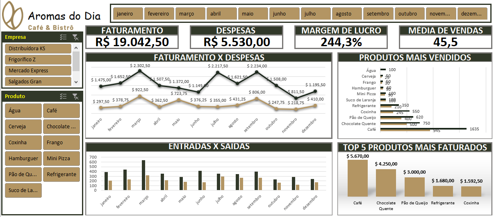

  
  

# Inventory Control for Café and Bistro "Aromas do Dia"

## Business Problem

The Café and Bistro "Aromas do Dia" faces challenges in efficiently managing its inventory of ingredients and products. The lack of visibility and control over stock levels leads to issues such as shortages of essential products during peak hours and food waste due to excessive purchases.

In this context, the primary purpose of this project is to conceive a Dashboard that provides meaningful and beneficial insights, aiming to enhance the organization's processes.

## Assumptions assumed for analysis

To address the problem, we assume the following premises:

- Inventory data is available in electronic records, including information on products, quantities in stock, and dates of entry and exit.
- The team has basic knowledge of Excel and is willing to learn new tools to improve inventory control.
- The chosen tool for analysis will be Excel with Power Pivot, due to its ability to handle large datasets and create dynamic data models.

## Solution strategy

With the aim of developing a Dashboard, we proceeded according to the following steps:

Step 1: Collect recent inventory data, including lists of products, available quantities, and dates of entry and exit.

Step 2: Clean and organize the data to ensure consistency and integrity.

Step 3: Import the data into Excel and create a data model using Power Pivot.

Step 4: Create measures and calculations to track stock variations over time, such as daily sales averages and recommended minimum stock levels.

Step 5: Design interactive data visualizations, such as line graphs and pivot tables, to monitor stock in real time and identify trends.

Step 6: Implement automatic alerts to notify the team when stock levels reach the minimum limit or when there are significant variations in sales.

## Top 3 Data Insights

1. We identified products with higher turnover, allowing for more accurate stock replenishment planning.
2. We analyzed seasonal sales trends to adjust stock levels according to demand.
3. We monitored food waste and identified opportunities to reduce costs and improve operational efficiency.

## Result

## Conclusion

In light of the presented context and the steps taken, the implementation of inventory control using the Excel dashboard with Power Pivot has provided Café and Bistro "Aromas do Dia" with a valuable tool to improve operational efficiency and reduce waste. The insights obtained allow for more effective resource management and a better experience for customers.

## Next steps

- Train the team on how to use and interpret the inventory control dashboard to ensure its adoption and effective use.
- Incorporate team feedback and adjust the dashboard as needed to meet specific business needs.
- Explore the possibility of integrating additional data, such as supplier information and production costs, for a more comprehensive analysis.
- Evaluate the feasibility of automating stock replenishment processes and purchase orders to further improve operational efficiency.
